eBird data practical: Yucatan Peninsula birds
================
Szymek Drobniak
12/4/25

# Overview

You will work with three small teaching datasets supplied with this
practical:

- `ebird_yucatan_checklists.csv` – checklist-level data (location, date,
  land cover, effort).
- `ebird_yucatan.csv` – species-level detections linked to checklists.
- `ebird_yucatan_traits.csv` – simple functional traits for a subset of
  Yucatan bird species.

The workflow is **loosely inspired** by:

- Stewart et al. (2025) – threat abatement and conservation of global
  bird diversity.
- Matthews et al. (2024) – global loss of avian functional and
  phylogenetic diversity.

We will not reproduce the papers, but we will **borrow their ideas**:
habitat loss, extinction risk, and functional diversity.

# 0. Getting started

## 0.1. Set your working directory

Place all files in the same directory:

- this Quarto file: `ebird_yucatan_practical.qmd`
- `ebird_yucatan_checklists.csv`
- `ebird_yucatan.csv`
- `ebird_yucatan_traits.csv`

Then set the working directory in R (only if needed):

``` r
# setwd("path/to/your/folder")  # <- adjust and uncomment if necessary
```

# 0A. Initial data exploration with Microsoft Excel

Before diving into R, let’s get familiar with the datasets using
Microsoft Excel (or LibreOffice Calc, Google Sheets, etc.). Open the
three CSV files in your spreadsheet software.

## Exercise 0A.1: Exploring the checklist data

Open `ebird_yucatan_checklists.csv` in Excel.

**Tasks:**

1.  **Count rows**: How many checklists are in the dataset?  
    *Hint: Look at the row numbers or use `=COUNTA()` function.*

2.  **Examine columns**: What variables are recorded for each
    checklist?  
    List at least 5 column names.

3.  **Date range**: What are the earliest and latest observation
    dates?  
    *Hint: Sort the `date` column or use `=MIN()` and `=MAX()`
    functions.*

4.  **Land cover types**: How many different land cover categories are
    there?  
    *Hint: Use a Pivot Table or filter the `land_cover` column to see
    unique values.*

5.  **Species richness**: Create a simple histogram of `n_species`
    values.

    - Select the `n_species` column
    - Insert → Chart → Histogram
    - What is the typical range of species per checklist?

6.  **Effort hours**: What is the average effort in hours per
    checklist?  
    *Hint: Use `=AVERAGE()` on the `effort_hours` column.*

## Exercise 0A.2: Exploring the species detection data

Open `ebird_yucatan.csv` in Excel.

**Tasks:**

1.  **Total observations**: How many species detection records are
    there?

2.  **Species diversity**: How many unique species are in the dataset?  
    *Hint: Copy the `scientific_name` column to a new sheet, then use
    Remove Duplicates (Data tab).*

3.  **Most common species**: Use a Pivot Table to find the most
    frequently detected species:

    - Create a Pivot Table with `scientific_name` in Rows
    - Add `checklist_ID` to Values (Count)
    - Sort by count descending
    - Which species appears in the most checklists?

4.  **Abundance patterns**: What is the maximum count recorded for any
    species in a single checklist?  
    *Hint: Use `=MAX()` on the `count` column.*

5.  **Link to checklists**: Pick one `checklist_ID` value and see how
    many species were recorded on that checklist.  
    *Hint: Use AutoFilter on the `checklist_ID` column.*

## Exercise 0A.3: Exploring the trait data

Open `ebird_yucatan_traits.csv` in Excel.

**Tasks:**

1.  **Trait coverage**: How many species have trait data available?

2.  **Body mass range**: What are the smallest and largest body masses
    in the dataset?  
    *Hint: Use `=MIN()` and `=MAX()` on `body_mass_g`.*

3.  **Trophic niches**: What different trophic niche categories are
    present?  
    *Hint: Filter or create a Pivot Table on `trophic_niche`.*

4.  **Trait relationships**: Create a scatter plot of `body_mass_g` vs
    `wing_length`:

    - Select both columns
    - Insert → Chart → Scatter plot
    - Do you see any relationship?

5.  **Beak dimensions**: Which species has the longest beak (culmen)?  
    *Hint: Sort by `beak_length_culmen` descending.*

## Exercise 0A.4: Linking datasets (challenge - for homework)

**Tasks:**

1.  Using Excel’s `VLOOKUP` or `XLOOKUP`, try to match species from the
    detection file to their traits:
    - In the detections file, add a new column for `body_mass_g`
    - Use a lookup formula to fetch body mass from the traits file
    - Formula example: `=VLOOKUP(B2, traits!A:B, 2, FALSE)`
2.  Calculate the average body mass of species detected in your first
    checklist.

**Reflection questions:**

- What patterns did you notice in the data?
- Which land cover type has the most sampling effort?
- What are some challenges of working with these data in Excel?
- What questions would be easier to answer with R?

## 0.2. Load required packages

We will use only widely available R packages. First - install, manually,
the `pacman` package if needed.

``` r
library(pacman)

p_load(
    tidyverse, sf, rnaturalearth,
    rnaturalearthdata, FD,
    ggrepel, textshape
)
```

## 0.3. Load the datasets in R

Now we’ll load the same datasets into R for more sophisticated analysis.

``` r
checklists <- read_csv("ebird_yucatan_checklists.csv")
```

    Rows: 37912 Columns: 11
    ── Column specification ────────────────────────────────────────────────────────
    Delimiter: ","
    chr  (3): checklist_ID, observer_ID, land_cover
    dbl  (7): year, month, latitude, longitude, effort_hours, n_species, land_co...
    date (1): date

    ℹ Use `spec()` to retrieve the full column specification for this data.
    ℹ Specify the column types or set `show_col_types = FALSE` to quiet this message.

``` r
detections <- read_csv("ebird_yucatan.csv")
```

    Rows: 727110 Columns: 5
    ── Column specification ────────────────────────────────────────────────────────
    Delimiter: ","
    chr (4): checklist_ID, species_code, scientific_name, common_name
    dbl (1): count

    ℹ Use `spec()` to retrieve the full column specification for this data.
    ℹ Specify the column types or set `show_col_types = FALSE` to quiet this message.

``` r
traits     <- read_csv("ebird_yucatan_traits.csv")
```

    Rows: 728 Columns: 8
    ── Column specification ────────────────────────────────────────────────────────
    Delimiter: ","
    chr (3): species_code, scientific_name, trophic_niche
    dbl (5): body_mass_g, beak_length_culmen, beak_length_nares, beak_width, win...

    ℹ Use `spec()` to retrieve the full column specification for this data.
    ℹ Specify the column types or set `show_col_types = FALSE` to quiet this message.

``` r
glimpse(checklists)
```

    Rows: 37,912
    Columns: 11
    $ checklist_ID    <chr> "S16159516", "S16160400", "S16160982", "S16164120", "S…
    $ date            <date> 2014-01-01, 2014-01-01, 2014-01-01, 2014-01-01, 2014-…
    $ year            <dbl> 2014, 2014, 2014, 2014, 2014, 2014, 2014, 2014, 2014, …
    $ month           <dbl> 1, 1, 1, 1, 1, 1, 1, 1, 1, 1, 1, 1, 1, 1, 1, 1, 1, 1, …
    $ latitude        <dbl> 16.09476, 20.98580, 20.08957, 21.33032, 18.98941, 14.3…
    $ longitude       <dbl> -88.83536, -87.21359, -89.54980, -86.92383, -86.02844,…
    $ effort_hours    <dbl> 9.6666667, 3.0000000, 0.4666667, 1.5000000, 0.5000000,…
    $ observer_ID     <chr> "obsr246930", "obsr411187", "obsr174363", "obsr411187"…
    $ n_species       <dbl> 41, 83, 12, 15, 11, 8, 18, 14, 33, 1, 13, 5, 66, 32, 5…
    $ land_cover_code <dbl> 10, 30, 10, 10, NA, 10, 10, 10, 10, 10, 30, 50, 10, 10…
    $ land_cover      <chr> "forest", "grassland", "forest", "forest", "other", "f…

``` r
glimpse(detections)
```

    Rows: 727,110
    Columns: 5
    $ checklist_ID    <chr> "S17908640", "S16466102", "S17697809", "S17110903", "S…
    $ species_code    <chr> "paltyr2", "ameavo", "blarob1", "oliwoo1", "brnpel", "…
    $ scientific_name <chr> "Zimmerius vilissimus", "Recurvirostra americana", "Tu…
    $ common_name     <chr> "Guatemalan Tyrannulet", "American Avocet", "Black Thr…
    $ count           <dbl> 4, 210, 1, 1, 30, 2, 50, 6, 1, 1, 2, 4, 3, 10, 1, 1, 4…

``` r
glimpse(traits)
```

    Rows: 728
    Columns: 8
    $ species_code       <chr> NA, NA, "shshaw", "blchaw1", "zothaw", "shthaw", "r…
    $ scientific_name    <chr> "Accipiter bicolor", "Accipiter cooperii", "Accipit…
    $ body_mass_g        <dbl> 287.5, 429.7, 130.6, 766.1, 745.9, 496.0, 1101.2, 5…
    $ beak_length_culmen <dbl> 25.0, 25.4, 18.3, 40.8, 35.1, 31.1, 37.6, 34.1, 28.…
    $ beak_length_nares  <dbl> 13.7, 13.9, 10.1, 27.1, 21.1, 17.0, 22.9, 20.9, 17.…
    $ beak_width         <dbl> 8.6, 8.6, 7.3, 12.5, 12.7, 10.4, 14.4, 11.4, 11.1, …
    $ wing_length        <dbl> 229.6, 241.2, 181.6, 393.5, 398.0, 307.6, 402.8, 26…
    $ trophic_niche      <chr> "Vertivore", "Vertivore", "Vertivore", "Aquatic pre…

**Task 0.1: Understanding the data**

1.  How many checklists are there in the dataset? Compare with your
    Excel count.
2.  Over which years do we have data?
3.  Which land cover types are represented?
4.  **Code understanding**: In the code above, what does the `glimpse()`
    function do?
5.  **Code understanding**: What symbol (`|>`) connects the different
    parts of the code? What is its purpose?

# 1. Mapping Yucatan Peninsula checklists and richness

In this part, we will:

1.  Plot all checklists on a map of the Yucatan Peninsula region.
2.  Compute basic species richness per checklist.
3.  Visualise spatial variation in richness.

## 1.1. Regional boundary and checklist locations

``` r
# get Yucatan Peninsula + surrounding regions boundaries
mx_states <- rnaturalearth::ne_states(country = "Mexico", returnclass = "sf") |>
  filter(name %in% c("Yucatán", "Campeche", "Quintana Roo", "Tabasco", "Chiapas"))
belize <- rnaturalearth::ne_countries(country = "Belize", returnclass = "sf")
guatemala <- rnaturalearth::ne_countries(country = "Guatemala", returnclass = "sf")

checklists_sf <- checklists |>
  st_as_sf(coords = c("longitude","latitude"), crs = 4326)

ggplot() +
  geom_sf(data = mx_states, fill = "grey95", color = "grey40") +
  geom_sf(data = belize, fill = "grey90", color = "grey30") +
  geom_sf(data = guatemala, fill = "grey90", color = "grey30") +
  geom_sf(data = checklists_sf, alpha = 0.6, size = 1) +
  coord_sf() +
  theme_minimal() +
  labs(title = "eBird-style checklists in Yucatan Peninsula region",
       x = "Longitude", y = "Latitude")
```

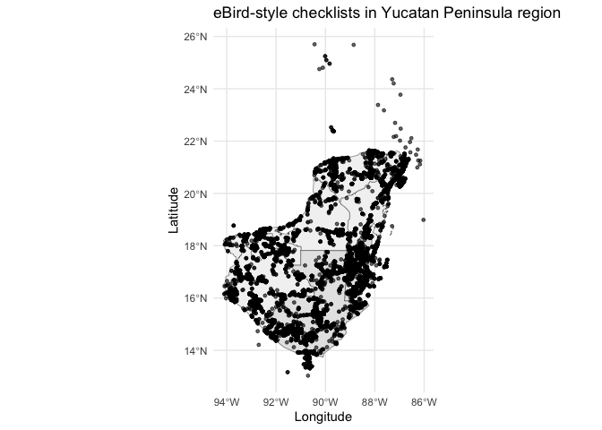

**Task 1.1: Spatial patterns**

1.  Which parts of the Yucatan Peninsula are sampled most densely?
2.  Do some land cover types seem under-sampled? (Use the code below to
    colour by land cover.)
3.  **Code understanding**: In the map code, what does `geom_sf()` do?
4.  Why might some areas have more checklists than others? List at least
    two possible reasons.

``` r
ggplot() +
  geom_sf(data = mx_states, fill = "grey95", color = "grey40") +
  geom_sf(data = belize, fill = "grey90", color = "grey30") +
  geom_sf(data = guatemala, fill = "grey90", color = "grey30") +
  geom_sf(data = checklists_sf, aes(color = land_cover), alpha = 0.7) +
  theme_minimal() +
  labs(title = "Checklists by land cover type")
```

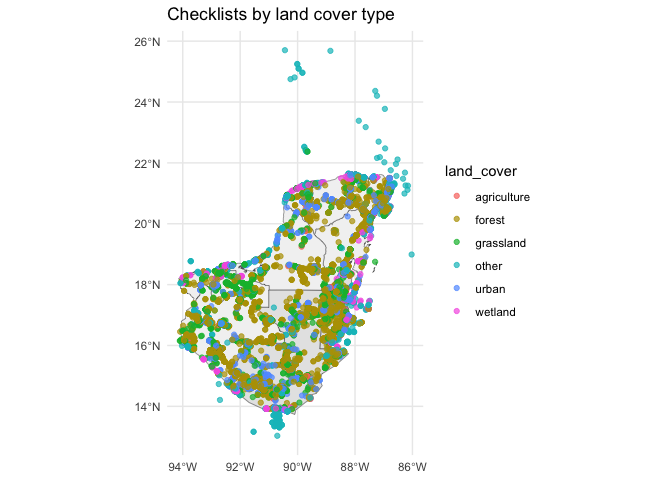

## 1.2. Species richness per checklist

The checklist data already include `n_species` (number of distinct
species recorded). We can visualise how richness varies spatially.

``` r
ggplot() +
  geom_sf(data = mx_states, fill = "grey95", color = "grey40") +
  geom_sf(data = belize, fill = "grey90", color = "grey30") +
  geom_sf(data = guatemala, fill = "grey90", color = "grey30") +
  geom_sf(data = checklists_sf, aes(color = n_species), size = 1) +
  scale_color_viridis_c(option = "plasma") +
  theme_minimal() +
  labs(title = "Species richness per checklist",
       color = "Richness")
```

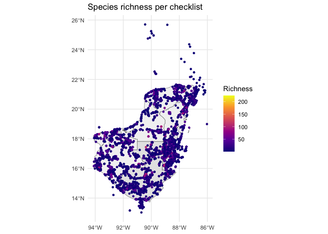

**Task 1.2: Richness patterns**

1.  Which land cover types have the highest average species richness?
2.  Use the code below to summarise richness by land cover and interpret
    the result.
3.  **Code understanding**: What does `group_by(land_cover)` do in the
    code below?
4.  **Code understanding**: What is the difference between
    `mean_richness` and `sd_richness`?
5.  Create a boxplot to visualize species richness by land cover (code
    provided below). Which land cover shows the most variation?

``` r
checklists |>
  group_by(land_cover) |>
  summarise(mean_richness = mean(n_species),
            sd_richness   = sd(n_species),
            n_checklists  = n())
```

    # A tibble: 6 × 4
      land_cover  mean_richness sd_richness n_checklists
      <chr>               <dbl>       <dbl>        <int>
    1 agriculture          12.9        11.6          172
    2 forest               20.3        22.3        22271
    3 grassland            19.7        20.4         5996
    4 other                16.2        15.7         2107
    5 urban                15.2        15.7         6007
    6 wetland              21.8        20.4         1359

``` r
# Boxplot of richness by land cover
ggplot(checklists, aes(x = land_cover, y = n_species, fill = land_cover)) +
  geom_boxplot() +
  theme_minimal() +
  theme(axis.text.x = element_text(angle = 45, hjust = 1)) +
  labs(title = "Species richness distribution by land cover",
       x = "Land cover type",
       y = "Number of species",
       fill = "Land cover")
```

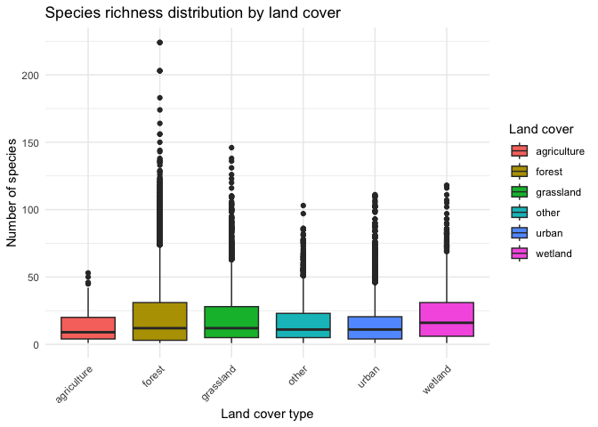

## 1.3. Spatial density mapping: sampling effort and species abundance

To better understand spatial patterns in eBird data, we can create
**density maps** using kernel density estimation. This is useful for:

1.  Visualising **sampling effort** (where are checklists concentrated?)
2.  Mapping **species abundance** (where are particular species most
    abundant?)

We will use the `ggplot2::stat_density_2d()` function to create smooth
density surfaces.

### 1.3.1. Sampling effort density

``` r
# Create a bounding box for the region
region_bbox <- st_bbox(c(xmin = -92, xmax = -86, ymin = 15, ymax = 22), crs = 4326)

ggplot() +
  geom_sf(data = mx_states, fill = "grey95", color = "grey40") +
  geom_sf(data = belize, fill = "grey90", color = "grey30") +
  geom_sf(data = guatemala, fill = "grey90", color = "grey30") +
  stat_density_2d(data = checklists, 
                  aes(x = longitude, y = latitude, fill = after_stat(level)),
                  geom = "polygon", alpha = 0.5, bins = 10) +
  scale_fill_viridis_c(option = "magma") +
  coord_sf(xlim = c(-92, -86), ylim = c(15, 22)) +
  theme_minimal() +
  labs(title = "eBird sampling effort density",
       subtitle = "Kernel density estimation of checklist locations",
       fill = "Density",
       x = "Longitude", y = "Latitude")
```

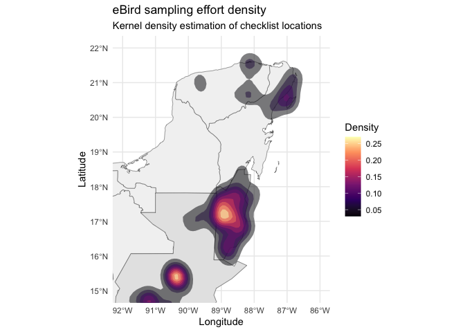

### 1.3.2. Species abundance density

Now let’s map the spatial density of a particular species. We’ll select
a common species and map where it’s most frequently detected.

``` r
# Choose a common species (adjust species_code as needed)
focal_species <- "yebsap"  # Yellow-bellied Sapsucker as example

# Get detections with location data
species_detections <- detections |>
  filter(species_code == focal_species) |>
  left_join(checklists |> select(checklist_ID, longitude, latitude), 
            by = "checklist_ID")

# Plot species abundance density
ggplot() +
  geom_sf(data = mx_states, fill = "grey95", color = "grey40") +
  geom_sf(data = belize, fill = "grey90", color = "grey30") +
  geom_sf(data = guatemala, fill = "grey90", color = "grey30") +
  stat_density_2d(data = species_detections,
                  aes(x = longitude, y = latitude, fill = after_stat(level)),
                  geom = "polygon", alpha = 0.6, bins = 8) +
  scale_fill_viridis_c(option = "plasma") +
  coord_sf(xlim = c(-92, -86), ylim = c(15, 22)) +
  theme_minimal() +
  labs(title = paste("Abundance density:", focal_species),
       subtitle = "Kernel density of species detections",
       fill = "Density",
       x = "Longitude", y = "Latitude")
```

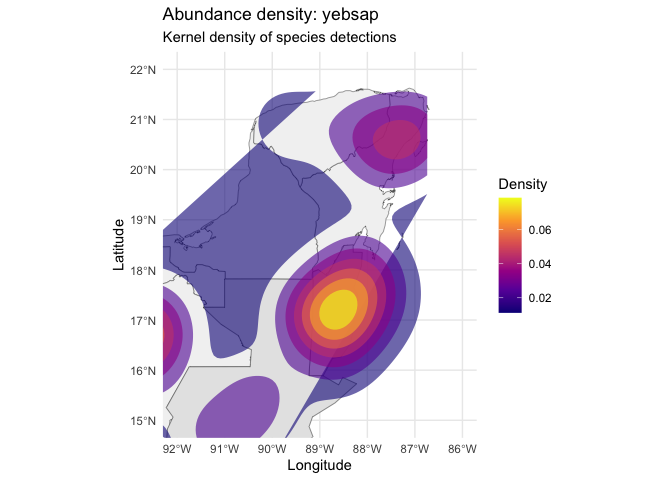

### 1.3.3. Weighted abundance density

We can also weight the density by actual counts, giving more emphasis to
locations where the species was seen in higher numbers.

``` r
ggplot() +
  geom_sf(data = mx_states, fill = "grey95", color = "grey40") +
  geom_sf(data = belize, fill = "grey90", color = "grey30") +
  geom_sf(data = guatemala, fill = "grey90", color = "grey30") +
  stat_density_2d(data = species_detections,
                  aes(x = longitude, y = latitude, 
                      fill = after_stat(level), weight = count),
                  geom = "polygon", alpha = 0.6, bins = 8) +
  scale_fill_viridis_c(option = "plasma") +
  coord_sf(xlim = c(-92, -86), ylim = c(15, 22)) +
  theme_minimal() +
  labs(title = paste("Weighted abundance density:", focal_species),
       subtitle = "Kernel density weighted by observation counts",
       fill = "Density",
       x = "Longitude", y = "Latitude")
```

    Warning in stat_density_2d(data = species_detections, aes(x = longitude, :
    Ignoring unknown aesthetics: weight

    Warning: The following aesthetics were dropped during statistical transformation:
    weight.
    ℹ This can happen when ggplot fails to infer the correct grouping structure in
      the data.
    ℹ Did you forget to specify a `group` aesthetic or to convert a numerical
      variable into a factor?

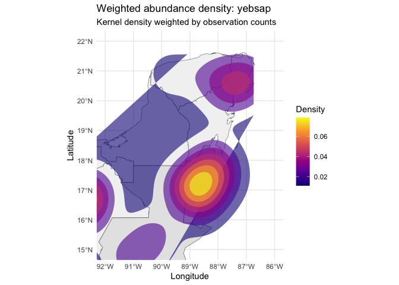

### 1.3.4. Hexagonal binning for abundance extrapolation

Hexagonal bins provide an alternative way to visualize spatial patterns
and can be used to extrapolate species abundance across the region. This
approach aggregates observations into hexagonal cells, which provides a
smooth representation while being computationally efficient.

``` r
# Hexbin map of sampling effort
ggplot() +
  geom_sf(data = mx_states, fill = "grey95", color = "grey40") +
  geom_sf(data = belize, fill = "grey90", color = "grey30") +
  geom_sf(data = guatemala, fill = "grey90", color = "grey30") +
  geom_hex(data = checklists, 
           aes(x = longitude, y = latitude), 
           bins = 30, alpha = 0.7) +
  scale_fill_viridis_c(option = "magma", trans = "log10") +
  coord_sf(xlim = c(-92, -86), ylim = c(15, 22)) +
  theme_minimal() +
  labs(title = "Sampling effort: hexagonal binning",
       subtitle = "Number of checklists per hexagonal cell",
       fill = "Checklists\n(log scale)",
       x = "Longitude", y = "Latitude")
```

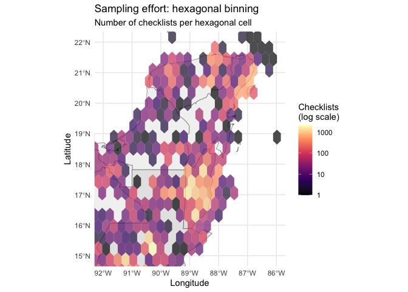

``` r
# Hexbin map of species abundance
ggplot() +
  geom_sf(data = mx_states, fill = "grey95", color = "grey40") +
  geom_sf(data = belize, fill = "grey90", color = "grey30") +
  geom_sf(data = guatemala, fill = "grey90", color = "grey30") +
  geom_hex(data = species_detections,
           aes(x = longitude, y = latitude),
           bins = 25, alpha = 0.7) +
  scale_fill_viridis_c(option = "plasma", name = "Detections") +
  coord_sf(xlim = c(-92, -86), ylim = c(15, 22)) +
  theme_minimal() +
  labs(title = paste("Species distribution:", focal_species),
       subtitle = "Hexagonal binning of detection locations",
       x = "Longitude", y = "Latitude")
```

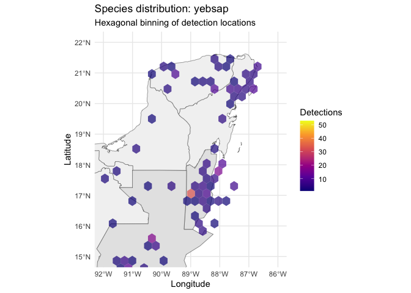

``` r
# Hexbin map weighted by abundance (sum of counts per cell)
ggplot() +
  geom_sf(data = mx_states, fill = "grey95", color = "grey40") +
  geom_sf(data = belize, fill = "grey90", color = "grey30") +
  geom_sf(data = guatemala, fill = "grey90", color = "grey30") +
  stat_summary_hex(data = species_detections,
                   aes(x = longitude, y = latitude, z = count),
                   fun = sum, bins = 25, alpha = 0.7) +
  scale_fill_viridis_c(option = "plasma", name = "Total\ncount") +
  coord_sf(xlim = c(-92, -86), ylim = c(15, 22)) +
  theme_minimal() +
  labs(title = paste("Abundance extrapolation:", focal_species),
       subtitle = "Total counts aggregated in hexagonal cells",
       x = "Longitude", y = "Latitude")
```

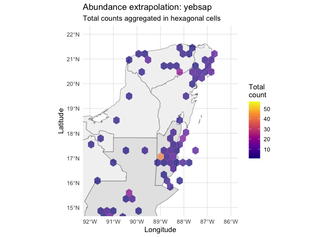

``` r
# Mean abundance per hexagonal cell
ggplot() +
  geom_sf(data = mx_states, fill = "grey95", color = "grey40") +
  geom_sf(data = belize, fill = "grey90", color = "grey30") +
  geom_sf(data = guatemala, fill = "grey90", color = "grey30") +
  stat_summary_hex(data = species_detections,
                   aes(x = longitude, y = latitude, z = count),
                   fun = mean, bins = 25, alpha = 0.7) +
  scale_fill_viridis_c(option = "plasma", name = "Mean\ncount") +
  coord_sf(xlim = c(-92, -86), ylim = c(15, 22)) +
  theme_minimal() +
  labs(title = paste("Mean abundance:", focal_species),
       subtitle = "Average counts per hexagonal cell",
       x = "Longitude", y = "Latitude")
```

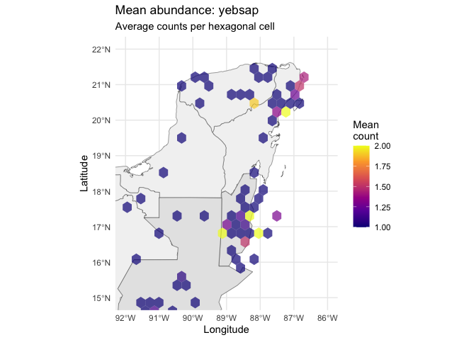

**Task 1.3: Spatial density patterns**

1.  Where is sampling effort most concentrated in the Yucatan Peninsula?
2.  How does the distribution of your focal species compare to overall
    sampling effort?
3.  Choose a different species from the dataset and create its abundance
    density map. What does this tell you about the species’
    distribution?
4.  Why might it be important to account for sampling effort when
    interpreting species distribution patterns?
5.  Compare the hexagonal binning approach to kernel density estimation.
    What are the advantages of each method?
6.  How do the total count and mean count hexbin maps differ in their
    interpretation? Which is more useful for understanding species
    distribution?
7.  **Code understanding**: What does `stat_density_2d()` do? Why is it
    useful for mapping?
8.  **Code understanding**: In the hexbin code, what does the
    `bins = 30` parameter control?

# 2. Species trends: reporting rates over time

Inspired by conservation concerns in the papers, we can examine
**reporting rates** of two species through time in this teaching
dataset.

## 2.1. Prepare annual reporting data

Reporting rate = proportion of complete checklists on which the species
was recorded.

``` r
# total number of checklists per year
total_per_year <- checklists |>
  count(year, name = "n_checklists")

# detections per species-year (presence on a checklist)
species_year <- detections |>
  distinct(checklist_ID, species_code) |>
  left_join(checklists |> select(checklist_ID, year), by = "checklist_ID") |>
  count(species_code, year, name = "n_checklists_with_species") |>
  left_join(total_per_year, by = "year") |>
  mutate(reporting_rate = n_checklists_with_species / n_checklists)

head(species_year)
```

    # A tibble: 6 × 5
      species_code  year n_checklists_with_species n_checklists reporting_rate
      <chr>        <dbl>                     <int>        <int>          <dbl>
    1 acafly        2014                        25        15788        0.00158
    2 acafly        2015                        31        22124        0.00140
    3 acowoo        2014                       675        15788        0.0428 
    4 acowoo        2015                       887        22124        0.0401 
    5 agaher1       2014                        43        15788        0.00272
    6 agaher1       2015                        78        22124        0.00353

## 2.2. Plot reporting rate trends

Redundant with our data.

``` r
# Select some species of interest
species_year |>
  filter(species_code %in% c("yebsap","plapar")) |>
  left_join(traits |> select(species_code, scientific_name), by = "species_code") |>
  ggplot(aes(x = year, y = reporting_rate, color = scientific_name)) +
  geom_line(size = 1) +
  geom_point() +
  theme_minimal() +
  labs(title = "Reporting rate trends for two focal species",
       y = "Reporting rate (proportion of checklists)",
       x = "Year",
       color = "Species")
```

    Warning: Using `size` aesthetic for lines was deprecated in ggplot2 3.4.0.
    ℹ Please use `linewidth` instead.

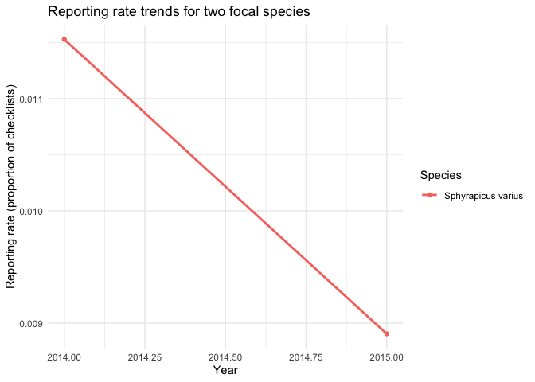

**Task 2.1: Temporal trends**

1.  Compare the reporting rate trends of the two species.  
2.  Which species appears more “secure” in the dataset? Why?
3.  How might habitat loss (as in Stewart et al.) affect these trends in
    real data?
4.  **Code understanding**: What does `reporting_rate` represent? How is
    it calculated?
5.  Calculate the annual percentage change in reporting rate for each
    species. Is either showing a significant trend?

## 2.3. Additional temporal analyses

### 2.3.1. Seasonal patterns in species richness

Let’s examine if species richness varies across different months, which
might reflect migratory patterns or seasonal breeding.

``` r
# Extract month from date and calculate monthly richness
checklists_monthly <- checklists |>
  mutate(month = lubridate::month(date, label = TRUE))

ggplot(checklists_monthly, aes(x = month, y = n_species)) +
  geom_boxplot(fill = "steelblue", alpha = 0.7) +
  theme_minimal() +
  labs(title = "Seasonal variation in species richness",
       x = "Month",
       y = "Number of species per checklist")
```

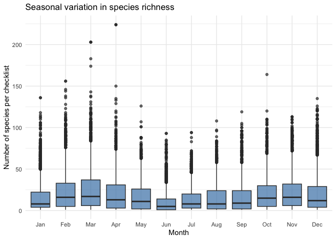

**Task 2.2: Seasonal patterns**

1.  Which months show the highest species richness? Why might this be?
2.  Are there any months with notably lower richness? What might explain
    this?
3.  **Code understanding**: What does
    `lubridate::month(date, label = TRUE)` do?

### 2.3.2. Effort and richness relationship

Does observer effort (hours spent birding) relate to species detected?

``` r
ggplot(checklists, aes(x = effort_hours, y = n_species)) +
  geom_point(alpha = 0.4, color = "darkblue") +
  geom_smooth(method = "lm", color = "red", se = TRUE) +
  theme_minimal() +
  labs(title = "Relationship between observer effort and species richness",
       x = "Effort (hours)",
       y = "Number of species detected")
```

    `geom_smooth()` using formula = 'y ~ x'

    Warning: Removed 9167 rows containing non-finite outside the scale range
    (`stat_smooth()`).

    Warning: Removed 9167 rows containing missing values or values outside the scale range
    (`geom_point()`).

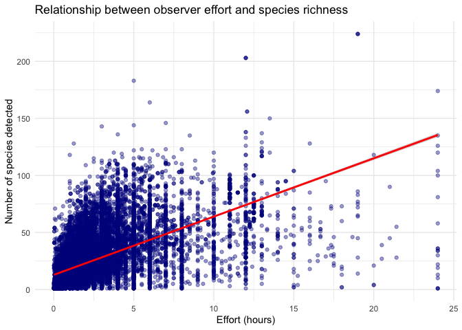

``` r
# Calculate correlation
cor_test <- cor.test(checklists$effort_hours, checklists$n_species)
print(paste("Correlation:", round(cor_test$estimate, 3)))
```

    [1] "Correlation: 0.586"

``` r
print(paste("P-value:", format(cor_test$p.value, scientific = TRUE)))
```

    [1] "P-value: 0e+00"

**Task 2.3: Effort analysis**

1.  Is there a relationship between effort and species detected?
2.  What does this tell us about how to compare checklists with
    different effort levels?
3.  **Code understanding**: What does `geom_smooth(method = "lm")` add
    to the plot?
4.  Should we control for effort when comparing richness across
    habitats? Why or why not?

# 3. Land cover comparison: community composition

We want to know whether land cover types differ in their **species
composition**.

## 3.1. Species-by-land-cover table

``` r
# join detections to checklist land cover
det_with_hab <- detections |>
  left_join(checklists |> select(checklist_ID, land_cover), by = "checklist_ID")

species_habitat <- det_with_hab |>
  group_by(land_cover, scientific_name) |>
  summarise(n_checklists = n_distinct(checklist_ID),
            total_count  = sum(count), .groups = "drop")

species_habitat
```

    # A tibble: 3,841 × 4
       land_cover  scientific_name       n_checklists total_count
       <chr>       <chr>                        <int>       <dbl>
     1 agriculture Accipiter striatus               2           2
     2 agriculture Actitis macularius              10          35
     3 agriculture Agelaius phoeniceus              7         149
     4 agriculture Aimophila rufescens              7           8
     5 agriculture Amazilia candida                 1           4
     6 agriculture Amazilia cyanocephala            6           8
     7 agriculture Amazilia rutila                  2           4
     8 agriculture Amazilia tzacatl                 7          13
     9 agriculture Amazona albifrons                4          11
    10 agriculture Amazona autumnalis              11          36
    # ℹ 3,831 more rows

## 3.2. Most frequently detected species per land cover

``` r
species_habitat |>
  group_by(land_cover) |>
  slice_max(order_by = n_checklists, n = 5) |>
  arrange(land_cover, desc(n_checklists))
```

    # A tibble: 30 × 4
    # Groups:   land_cover [6]
       land_cover  scientific_name      n_checklists total_count
       <chr>       <chr>                       <int>       <dbl>
     1 agriculture Cathartes aura                 60         383
     2 agriculture Sporophila morelleti           46         270
     3 agriculture Coragyps atratus               42         521
     4 agriculture Quiscalus mexicanus            41         438
     5 agriculture Dives dives                    34         107
     6 forest      Myiozetetes similis          6400       19010
     7 forest      Dives dives                  6204       21467
     8 forest      Turdus grayi                 6060       18410
     9 forest      Melanerpes aurifrons         5998       12106
    10 forest      Coragyps atratus             5804       38600
    # ℹ 20 more rows

**Task 3.1: Community composition**

1.  Which species dominate urban vs forest checklists?  
2.  Do the dominant species match your expectations for those land cover
    types?
3.  Create a bar plot showing the top 10 most detected species overall
    (code below). Which habitat specialists appear?
4.  **Code understanding**: What does `slice_max()` do in the code?

``` r
# Top 10 most frequently detected species overall
top_species <- detections |>
  group_by(scientific_name) |>
  summarise(n_detections = n(),
            total_individuals = sum(count)) |>
  arrange(desc(n_detections)) |>
  slice_head(n = 10)

ggplot(top_species, aes(x = reorder(scientific_name, n_detections), 
                        y = n_detections)) +
  geom_col(fill = "forestgreen") +
  coord_flip() +
  theme_minimal() +
  labs(title = "Top 10 most frequently detected species",
       x = "Species",
       y = "Number of detections")
```

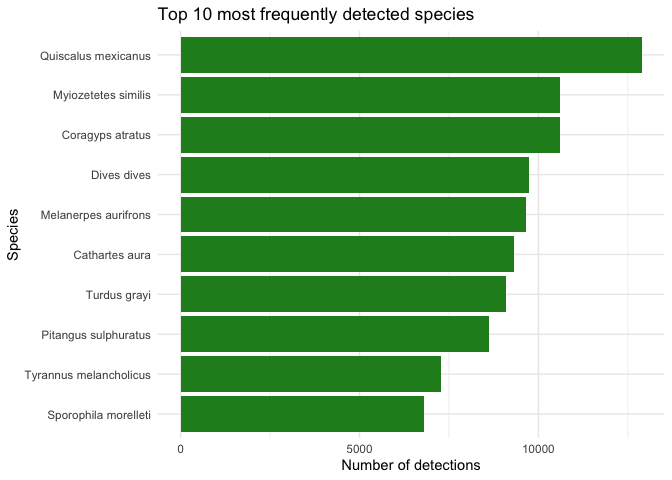

## 3.3. Species specialization analysis

Some species are habitat specialists while others are generalists. Let’s
identify them.

``` r
# Calculate number of land cover types each species uses
species_habitat_breadth <- det_with_hab |>
  group_by(scientific_name) |>
  summarise(n_habitats = n_distinct(land_cover),
            total_detections = n()) |>
  filter(total_detections >= 5)  # Only species with sufficient detections

# Classify as specialist vs generalist
species_habitat_breadth <- species_habitat_breadth |>
  mutate(habitat_use = case_when(
    n_habitats == 1 ~ "Specialist",
    n_habitats >= 3 ~ "Generalist",
    TRUE ~ "Intermediate"
  ))

ggplot(species_habitat_breadth, aes(x = habitat_use, fill = habitat_use)) +
  geom_bar() +
  theme_minimal() +
  labs(title = "Distribution of habitat specialization",
       x = "Habitat use category",
       y = "Number of species",
       fill = "Category")
```

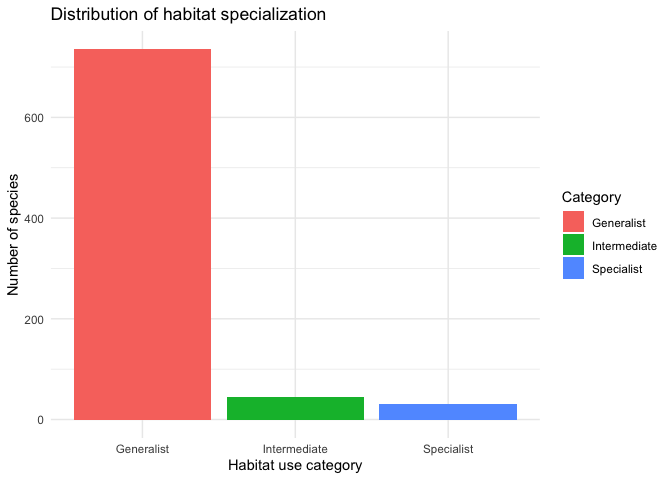

**Task 3.2: Habitat specialization**

1.  How many species are habitat specialists vs generalists?
2.  Why might generalist species be more resilient to habitat loss?
3.  Identify 2-3 specialist species. In which habitat are they found?
4.  **Code understanding**: What does `case_when()` do in the code
    above?

# 4. Functional diversity by land cover

Now we bring in **functional traits** to approximate ideas from Matthews
et al. (functional diversity and non-random loss of traits).

We will:

1.  Create a trait matrix for the species in our dataset.
2.  Compute simple functional diversity (FD) indices for each land cover
    type.
3.  Visualise trait structure across land cover types.

## 4.1. Trait matrix for species

We will use numeric traits:

- body mass (g)
- beak length culmen (mm)
- wing length (mm)
- beak width (mm)

``` r
# species present in traits data
species_present <- traits |>
  distinct(scientific_name) |>
  pull()

traits_num <- traits |>
  filter(scientific_name %in% species_present) |>
  arrange(scientific_name) |>
  column_to_rownames("scientific_name") |>
  select(body_mass_g, beak_length_culmen, wing_length, beak_width)

head(traits_num)
```

                            body_mass_g beak_length_culmen wing_length beak_width
    Abeillia abeillei               2.7               13.0        47.0        1.2
    Accipiter bicolor             287.5               25.0       229.6        8.6
    Accipiter cooperii            429.7               25.4       241.2        8.6
    Accipiter striatus            130.6               18.3       181.6        7.3
    Acrocephalus scirpaceus        12.3               18.2        65.3        3.2
    Actitis macularius             40.4               25.7       100.4        2.7

## 4.2. Species relative abundance by land cover

`FD::dbFD()` expects species abundances (or presence–absence) per site.
Here, we treat **land cover types as sites** and use `total_count` as
abundance.

``` r
abund_habitat <- species_habitat |>
  filter(scientific_name %in% species_present) |>
  arrange(scientific_name) |>
  select(land_cover, scientific_name, total_count) |>
  pivot_wider(names_from = scientific_name, values_from = total_count, values_fill = 0) |>
  column_to_rownames("land_cover")

abund_habitat[, 1:7]
```

                Abeillia abeillei Accipiter bicolor Accipiter cooperii
    forest                    764                65                 61
    grassland                  16                 5                 18
    urban                       3                 1                 14
    wetland                     0                 3                  0
    other                       0                 0                  1
    agriculture                 0                 0                  0
                Accipiter striatus Acrocephalus scirpaceus Actitis macularius
    forest                     188                       0               2090
    grassland                   48                       0               1206
    urban                       37                       0               1038
    wetland                      0                       1                992
    other                        0                       0               1167
    agriculture                  2                       0                 35
                Aegolius ridgwayi
    forest                     21
    grassland                   4
    urban                       0
    wetland                     0
    other                       0
    agriculture                 0

## 4.3. Compute functional diversity indices

We will calculate:

- FRic – functional richness (volume of convex hull in trait space)
- FEve – functional evenness
- FDiv – functional divergence
- RaoQ – Rao’s quadratic entropy

``` r
fd_res <- dbFD(traits_num, abund_habitat, calc.FRic = TRUE, calc.FDiv = TRUE,
               calc.FGR = FALSE, m = "max", messages = FALSE)

fd_indices <- tibble(
  land_cover = rownames(abund_habitat),
  FRic    = fd_res$FRic,
  FEve    = fd_res$FEve,
  FDiv    = fd_res$FDiv,
  RaoQ    = fd_res$RaoQ
)

fd_indices
```

    # A tibble: 6 × 5
      land_cover   FRic   FEve  FDiv  RaoQ
      <chr>       <dbl>  <dbl> <dbl> <dbl>
    1 forest       381. 0.0649 0.766  4.32
    2 grassland    263. 0.298  0.745  7.01
    3 urban        266. 0.289  0.787 10.3 
    4 wetland      260. 0.374  0.797 14.7 
    5 other        267. 0.377  0.788 13.2 
    6 agriculture  164. 0.427  0.691  4.36

## 4.4. Visualising functional diversity differences

``` r
fd_indices_long <- fd_indices |>
  pivot_longer(cols = -land_cover, names_to = "index", values_to = "value")

ggplot(fd_indices_long, aes(x = land_cover, y = value, fill = land_cover)) +
  geom_col() +
  facet_wrap(~ index, scales = "free_y") +
  theme_minimal() +
  theme(axis.text.x = element_text(angle = 45, hjust = 1)) +
  labs(title = "Functional diversity of bird communities by land cover")
```

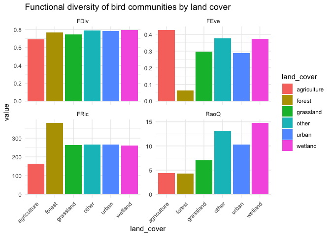

**Task 4.1: Functional diversity**

1.  Which land cover type has the highest functional richness (FRic)?  
2.  Does any land cover show low FRic but relatively high FEve or FDiv?
    How might that happen?  
3.  Relate your findings to the idea that anthropogenic extinctions can
    be **trait-biased** and reduce specific ecological functions
    (Matthews et al.).
4.  **Code understanding**: What does `pivot_longer()` do to the data?
5.  Rank the land cover types from highest to lowest functional
    diversity. Does this match the ranking by species richness?

## 4.5. Comparing taxonomic vs functional diversity

``` r
# Create comparison of taxonomic and functional diversity
diversity_comparison <- checklists |>
  group_by(land_cover) |>
  summarise(mean_species_richness = mean(n_species),
            total_species = n_distinct(n_species)) |>
  left_join(fd_indices |> select(land_cover, FRic, RaoQ), by = "land_cover")

# Standardize values for comparison (0-1 scale)
diversity_comparison <- diversity_comparison |>
  mutate(across(c(mean_species_richness, FRic, RaoQ), 
                ~(. - min(., na.rm=TRUE)) / (max(., na.rm=TRUE) - min(., na.rm=TRUE)),
                .names = "{.col}_scaled"))

# Plot comparison
diversity_comparison |>
  select(land_cover, mean_species_richness_scaled, FRic_scaled, RaoQ_scaled) |>
  pivot_longer(-land_cover, names_to = "diversity_metric", values_to = "value") |>
  ggplot(aes(x = land_cover, y = value, fill = diversity_metric)) +
  geom_col(position = "dodge") +
  theme_minimal() +
  theme(axis.text.x = element_text(angle = 45, hjust = 1)) +
  labs(title = "Taxonomic vs Functional Diversity by Land Cover",
       subtitle = "Scaled values (0-1) for comparison",
       x = "Land cover type",
       y = "Scaled diversity value",
       fill = "Metric") +
  scale_fill_brewer(palette = "Set2",
                    labels = c("Func. Richness", "Species Richness", "Rao's Q"))
```

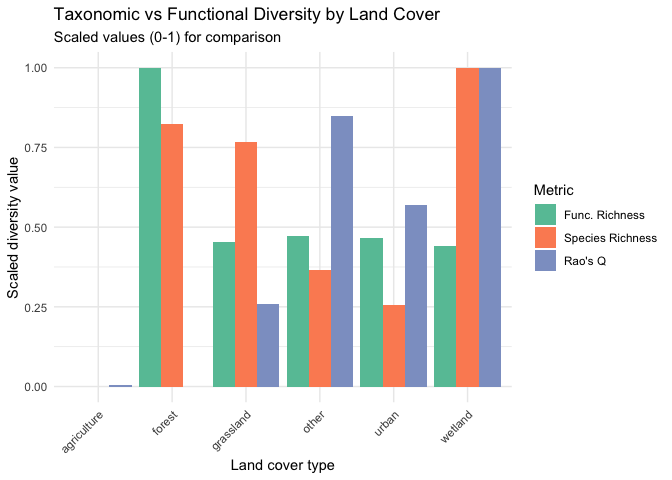

**Task 4.2: Taxonomic vs functional diversity**

1.  Do land cover types with high species richness always have high
    functional diversity?
2.  What does it mean if an area has high species richness but low
    functional diversity?
3.  Which metric (taxonomic or functional diversity) might be more
    important for conservation? Why?

# 5. Trait distributions in different land cover types

We can also look directly at traits of species that dominate each land
cover type.

## 5.1. Trait distributions weighted by abundance

Hint: what to do to make the graph clearer?

``` r
traits_long <- det_with_hab |>
  group_by(land_cover, scientific_name) |>
  summarise(total_count = sum(count), .groups = "drop") |>
  left_join(traits, by = "scientific_name")

ggplot(traits_long, aes(x = body_mass_g, weight = total_count, fill = land_cover)) +
  geom_histogram(alpha = 0.5, bins = 20, position = "identity") +
  theme_minimal() +
  labs(title = "Body mass distribution by land cover (abundance-weighted)",
       x = "Body mass (g)", y = "Weighted frequency")
```

    Warning: Removed 527 rows containing non-finite outside the scale range
    (`stat_bin()`).

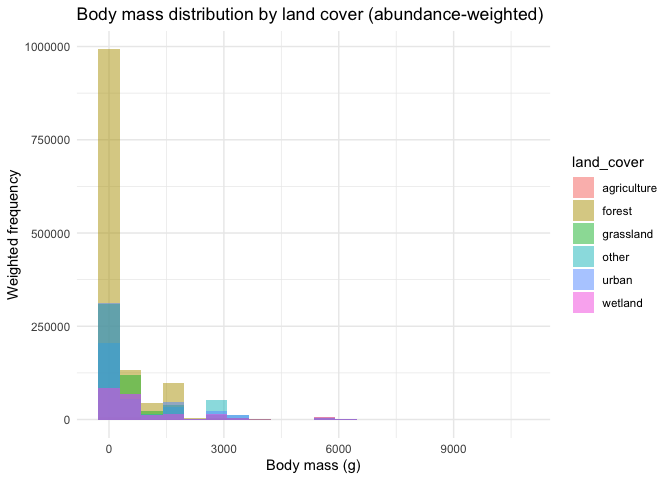

**Task 5.1: Trait distributions**

1.  Are large-bodied species more frequent in any particular land cover
    type?  
2.  How would selective loss of large-bodied species influence ecosystem
    functioning?
3.  Create a similar histogram for beak length instead of body mass
    (modify the code). Are there differences between habitats?
4.  **Code understanding**: What does the `weight = total_count`
    parameter do?

## 5.2. Trophic structure across land cover types

``` r
# Abundance of different trophic groups by land cover
trophic_habitat <- det_with_hab |>
  left_join(traits |> select(scientific_name, trophic_niche), 
            by = "scientific_name") |>
  filter(!is.na(trophic_niche)) |>
  group_by(land_cover, trophic_niche) |>
  summarise(total_count = sum(count),
            n_species = n_distinct(scientific_name),
            .groups = "drop")

# Stacked bar plot
ggplot(trophic_habitat, aes(x = land_cover, y = total_count, fill = trophic_niche)) +
  geom_col(position = "fill") +
  theme_minimal() +
  theme(axis.text.x = element_text(angle = 45, hjust = 1)) +
  labs(title = "Trophic structure by land cover type",
       subtitle = "Proportional abundance of feeding guilds",
       x = "Land cover type",
       y = "Proportion of total abundance",
       fill = "Trophic niche") +
  scale_y_continuous(labels = scales::percent)
```


**Task 5.2: Trophic ecology**

1.  Which trophic groups dominate in forests vs urban areas?
2.  What does the trophic structure tell you about ecosystem functioning
    in each habitat?
3.  If forests were converted to agriculture, which feeding guilds would
    likely decline most?
4.  **Code understanding**: What does `position = "fill"` do in the bar
    plot?

## 5.3. Body size and trophic relationships

``` r
# Relationship between body size and trophic niche
traits |>
  filter(!is.na(trophic_niche)) |>
  ggplot(aes(x = trophic_niche, y = body_mass_g, fill = trophic_niche)) +
  geom_boxplot() +
  scale_y_log10() +
  theme_minimal() +
  theme(axis.text.x = element_text(angle = 45, hjust = 1)) +
  labs(title = "Body mass variation among trophic guilds",
       x = "Trophic niche",
       y = "Body mass (g, log scale)",
       fill = "Trophic niche")
```

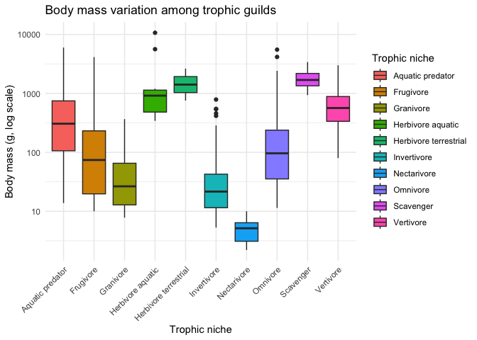

**Task 5.3: Body size ecology**

1.  Which trophic group has the largest average body size?
2.  Why might raptors or carnivores tend to be larger than insectivores?
3.  How might body size affect vulnerability to habitat loss?

# 6. Optional extension: PCA of traits

For a more visual representation of the trait space, we can perform a
simple PCA.

``` r
traits_scaled <- scale(traits_num)
pca <- prcomp(traits_scaled)

pca_scores <- as_tibble(pca$x, rownames = "scientific_name") |>
  left_join(traits |> select(scientific_name, trophic_niche), by = "scientific_name")

ggplot(pca_scores, aes(x = PC1, y = PC2, label = scientific_name,
                       color = trophic_niche)) +
  geom_point(size = 2) +
  ggrepel::geom_text_repel(size = 3, max.overlaps = 20) +
  theme_minimal() +
  labs(title = "Trait space of Yucatan Peninsula birds (teaching dataset)",
       subtitle = "PC1/PC2 of body mass, beak length, wing length, beak width")
```

    Warning: ggrepel: 714 unlabeled data points (too many overlaps). Consider
    increasing max.overlaps

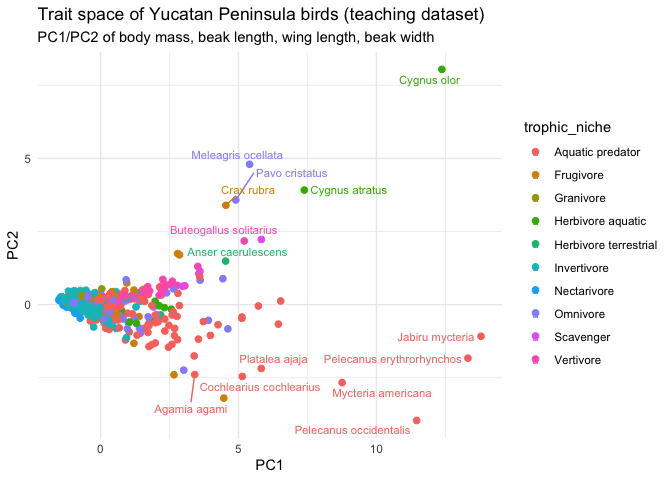

**Task 6.1: Trait space structure**

1.  Identify which traits mainly drive PC1 and PC2 (use `summary(pca)`).
2.  Discuss where species with different trophic niches lie in this
    space.
3.  **Code understanding**: What does PCA stand for and what does it do?
4.  Are species clustered by trophic niche or are they spread throughout
    trait space?

``` r
# Show PCA loadings
pca_loadings <- as.data.frame(pca$rotation[, 1:2])
pca_loadings$trait <- rownames(pca_loadings)

print("PCA Loadings (contribution of each trait to principal components):")
```

    [1] "PCA Loadings (contribution of each trait to principal components):"

``` r
print(pca_loadings)
```

                             PC1        PC2              trait
    body_mass_g        0.4909870  0.6852177        body_mass_g
    beak_length_culmen 0.4928609 -0.6304818 beak_length_culmen
    wing_length        0.5102736  0.2300149        wing_length
    beak_width         0.5056093 -0.2829532         beak_width

``` r
# Variance explained
variance_explained <- summary(pca)$importance[2, 1:2] * 100
print(paste("PC1 explains", round(variance_explained[1], 1), "% of variance"))
```

    [1] "PC1 explains 75.8 % of variance"

``` r
print(paste("PC2 explains", round(variance_explained[2], 1), "% of variance"))
```

    [1] "PC2 explains 10.1 % of variance"

# 7. Conservation prioritization exercise

Let’s apply what we’ve learned to identify priority areas for
conservation.

## 7.1. Creating a conservation value index

``` r
# Calculate multiple metrics per land cover type
conservation_metrics <- checklists |>
  group_by(land_cover) |>
  summarise(
    mean_richness = mean(n_species),
    n_checklists = n()
  ) |>
  left_join(fd_indices |> select(land_cover, FRic, RaoQ), by = "land_cover") |>
  # Standardize metrics
  mutate(
    richness_scaled = (mean_richness - min(mean_richness)) / 
                      (max(mean_richness) - min(mean_richness)),
    FRic_scaled = (FRic - min(FRic, na.rm=TRUE)) / 
                  (max(FRic, na.rm=TRUE) - min(FRic, na.rm=TRUE)),
    RaoQ_scaled = (RaoQ - min(RaoQ, na.rm=TRUE)) / 
                  (max(RaoQ, na.rm=TRUE) - min(RaoQ, na.rm=TRUE)),
    # Combined conservation value (equal weights)
    conservation_value = (richness_scaled + FRic_scaled + RaoQ_scaled) / 3
  ) |>
  arrange(desc(conservation_value))

print("Conservation priority ranking:")
```

    [1] "Conservation priority ranking:"

``` r
print(conservation_metrics |> select(land_cover, conservation_value, mean_richness, FRic, RaoQ))
```

    # A tibble: 6 × 5
      land_cover  conservation_value mean_richness  FRic  RaoQ
      <chr>                    <dbl>         <dbl> <dbl> <dbl>
    1 wetland                0.814            21.8  260. 14.7 
    2 forest                 0.608            20.3  381.  4.32
    3 other                  0.562            16.2  267. 13.2 
    4 grassland              0.493            19.7  263.  7.01
    5 urban                  0.431            15.2  266. 10.3 
    6 agriculture            0.00126          12.9  164.  4.36

``` r
# Visualize
ggplot(conservation_metrics, aes(x = reorder(land_cover, conservation_value),
                                 y = conservation_value,
                                 fill = conservation_value)) +
  geom_col() +
  coord_flip() +
  scale_fill_viridis_c(option = "magma") +
  theme_minimal() +
  labs(title = "Conservation value by land cover type",
       subtitle = "Based on species richness and functional diversity",
       x = "Land cover type",
       y = "Conservation value (scaled)",
       fill = "Value")
```

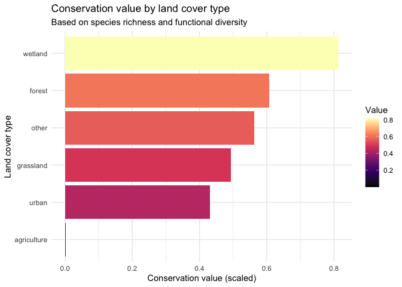

**Task 7.1: Conservation priorities**

1.  Which land cover type has the highest conservation value? Why?
2.  Would you prioritize differently if you weighted species richness
    more heavily than functional diversity? Why might you do this?
3.  What other factors (not in this dataset) should inform conservation
    priorities?
4.  **Code understanding**: How is the `conservation_value` calculated
    in the code?

# 8. Wrap-up questions

## 8.1. Synthesis questions

1.  How do species richness and functional diversity vary among land
    cover types in this dataset?  
2.  If habitat loss continues in the Yucatan Peninsula, which land cover
    types (and associated communities) do you think are at greatest
    risk?  
3.  Which land cover types would you prioritize for conservation based
    on your analyses?
4.  Did you find any trade-offs between different conservation metrics
    (e.g., high richness but low functional diversity)?
5.  How do your findings conceptually link to the key messages of
    Stewart et al. and Matthews et al.?

## 8.2. Methodological reflection

1.  What are the advantages of using citizen science data like eBird?
2.  What are potential biases or limitations of eBird data?
3.  How did accounting for observer effort change your interpretation of
    the results?
4.  Why is it important to consider both taxonomic and functional
    diversity?

## 8.3. Code understanding summary

Reflect on the R code you’ve used. Answer these questions:

1.  What is the pipe operator (`|>`) and why is it useful?
2.  Name three different types of plots you created (e.g., boxplot,
    scatter plot…).  
    When would you use each type?
3.  What does `group_by()` do and why is it useful for ecological data?
4.  What’s the difference between `filter()` and `select()`?
5.  Why do we often use `summarise()` after `group_by()`?

## 8.4. Extension ideas

You have completed the core practical. Feel free to extend the analyses,
for example by:

- Focusing on a single species of conservation concern and mapping its
  distribution
- Investigating whether there are temporal trends in specific trophic
  groups
- Comparing different regions within the Yucatan Peninsula
- Analyzing the relationship between multiple trait dimensions
  simultaneously
- Creating a species accumulation curve to assess sampling completeness
- Examining whether rare species have different traits than common
  species
- Testing for correlations between different functional diversity
  metrics
- Mapping hotspots of threatened or endemic species (if you add IUCN
  status data)

## 8.5. Connection to real-world conservation

1.  How could you integrate **real eBird data** and **more detailed
    trait datasets** (e.g. AVONET) to test similar questions at larger
    scales?  
2.  What additional data would help you make better conservation
    recommendations?
3.  How might climate change interact with habitat loss to affect these
    bird communities?
4.  If you were advising a conservation organization in Yucatan, what
    would be your top 3 recommendations based on this analysis?
